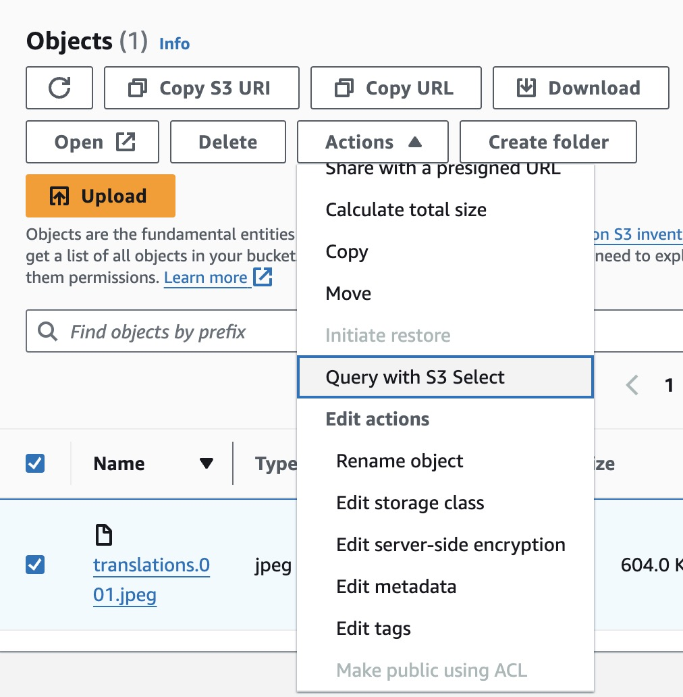

# Amazon Simple Storage Service (S3)

Amazon S3 是一個物件儲存服務，以部署在多個可用區域的方式提供最高達 99.99% 的可用性，換句話說，一年中的停機時間不會超過 52.56 分鐘。

## 物件儲存（Object Storage）

物件儲存是指一種儲存資料的技術，適合儲存非結構化資料。另外常見的儲存技術有檔案式儲存（File Storage）、塊式儲存（Block Storage）。

## Bucket

Bucket 是用來儲存 Object 的容器，同一個 Bucket 不會 Object 擁有一樣的 Key。

## Object

Object 是指儲存在 S3 上的檔案

## Object Maximum Size

如果使用 PUT Method 的話，單個 Object 最大 5GB，如果是以 Multipart Upload 上傳檔案，最多是 5TB。

## 計價項目

### Storage

Storage 是指儲存的檔案大小，會依照 GB 計費。

### GET, SELECT, and all other requests

Get Request 是指使用 Get Method 取得 Object，範例如下：

```
    GET /my-image.jpg HTTP/1.1
    Host: bucket.s3.<Region>.amazonaws.com
    Date: Mon, 3 Oct 2016 22:32:00 GMT
    Authorization: authorization string
```

Select 是指使用 SQL 搜尋 Object 內的資料，可以在 S3 Console 使用 Query with S3 Select 操作。
舉例來說，使用者可以針對一個資料型態為 JSON 的 Object 使用 SQL 搜尋裡面的資料。



### PUT, COPY, POST, LIST requests

PUT Request 是指使用 PUT Method 上傳檔案，像是使用 S3 Console 的上傳功能。
POST 與 PUT 一樣可以上傳檔案到 S3，比較常用在表單上。
COPY 是指複製已經在 Bucket 裡的 Object，像是 S3 Console 的 Copy 功能。
LIST 是指列出 Bucket 裡特定數量的 Objects（上限 1000）。

### Lifecycle Transition requests

Lifecycle Transition requests 是指調整 Object 的類別，像是把比較不常存取的 Object 轉換到比較便宜但取得資料時間較長的儲存類別

### Data Retrieval requests 與 Data retrievals

一些會 Archive 資料的儲存類別，使用者取得資料時會需要再加上這兩種計價項目。

### Data Transfer OUT From Amazon S3 To Internet

這是指資料傳輸到外部網際網路的費用。
