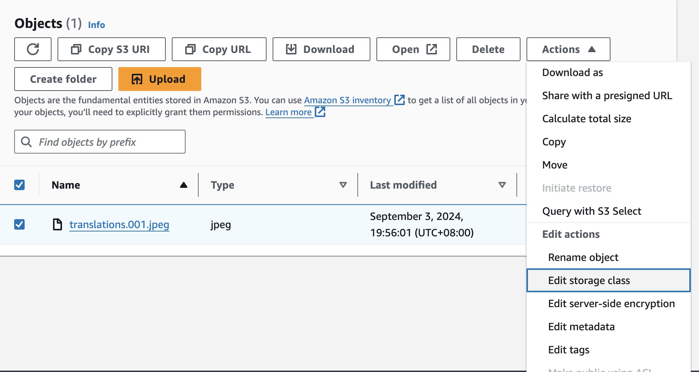

# Amazon S3 Storage Classes

Amazon S3 依照效能、定價和資料存取頻率分為不同的物件存取類別（Storage Class）。

## Default

### S3 Standard

預設的物件存取類別。

## Unknown or changing access

### S3 Intelligent - Tiering

S3 Intelligent - Tiering 會依照資料被取用的頻率分類資料到不同的類別，有 Frequent Access、Infrequent Access、Archive 和 Deep Archive ，依照類別不同會有不同的計價方式。

### S3 Express One Zone

S3 Express One Zone 提供比 S3 Standard 更快速和便宜的資料取用，但因為是部署在一個 AZ，使用者需要考量到 AZ 發生問題，資料喪失的風險。

## Infrequent Access

### S3 Standard - Infrequent Access

S3 Standard Infrequent Access 提供比 S3 Standard 便宜的 Storage 費用，適合儲存不常存取的資料。

### S3 One Zone - Infrequent Access

提供比 S3 Standard-IA 便宜的 Storage 費用，但與 S3 Express One Zone 一樣，資料只部署在單一 AZ。

## Archive

### S3 Glacier Instant Retrieval

S3 Glacier Instant Retrieval 讓使用者可以用便宜的價格儲存資料，但存取資料時會有額外的資料存取費用（Data Retrieval requests 與 Data retrievals）。

### S3 Glacier Flexible Retrieval

S3 Glacier Flexible Retrieval 提供使用者優惠的 Storage 費用，且另提供彈性解封存的方式，使用者可以選擇支付費用在幾分鐘內解封存資料，或者等 5 - 12 小時免費解封存資料。

### S3 Glacier Deep Archive

S3 Glacier Deep Archive 提供最低的 Storage 費用，但解封存資料需要花上 12 - 48 小時。
