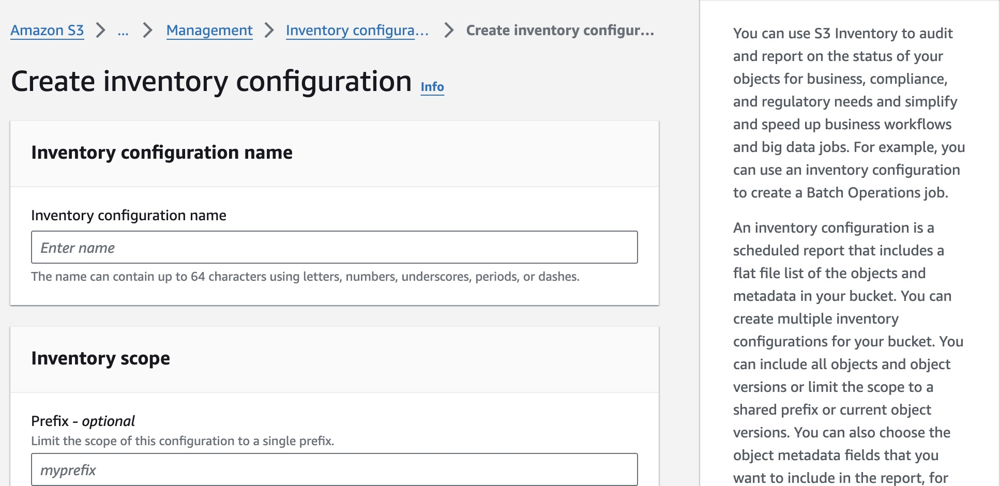
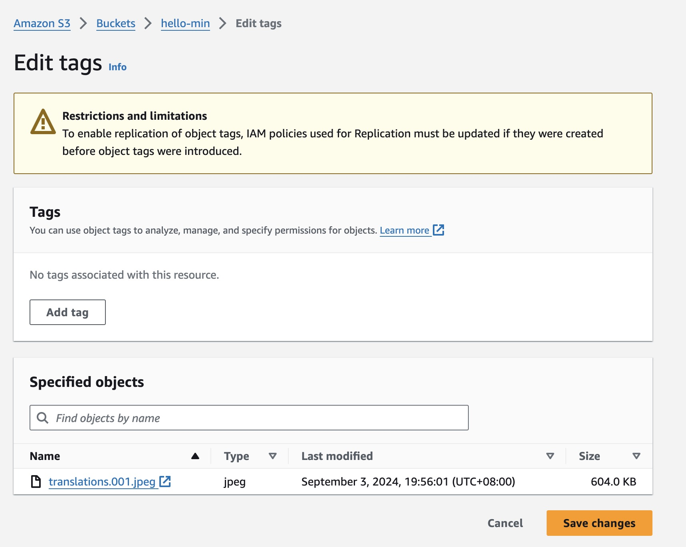
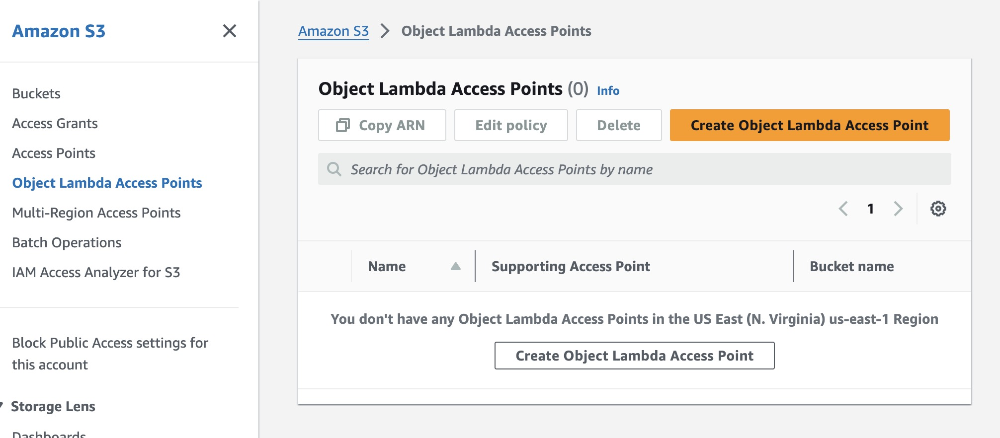

# 其他 S3 其他計價項目和服務

## Security Access & Control

### Dual-layer server-side encryption

S3 預設會對物件進行加密再儲存，你也可以選擇以雙層加密的方式儲存物件。

### S3 Access Grants

S3 Access Grant 讓你能夠連接上公司的 Coperate Directory 管理物件的存取權限。Coperate Directory 是一個儲存員工資料的服務。

## Management & Insights

### S3 Inventory

S3 Invertory 讓你方便管理你的儲存空間，舉例來說，你可以使用它來產生 Replication 的報告。

### S3 Object Tagging

你可以替物件新增標籤，如此一來，在使用監測服務時（像是 CloudWatch），你可以用 tag 過濾特定資料

### S3 Batch Operations

S3 Batch Operations 讓你能夠大規模地操作物件，像是複製物件或調整物件標籤 ⋯⋯ 等等

### S3 Storage Lens

監測儲存空間的使用狀況並提供成本優化的建議

### S3 Analytics Storage Class Analysis

監測物件的存取頻率並協助使用者轉移物件到適合的物件類別（Storage Class）

## Transform & Query

### S3 Object Lambda

S3 與 Lambda 可以搭配使用，在 S3 Get、Head 和 List 的時候，運行 Lambda 函示對物件做些預處理。

