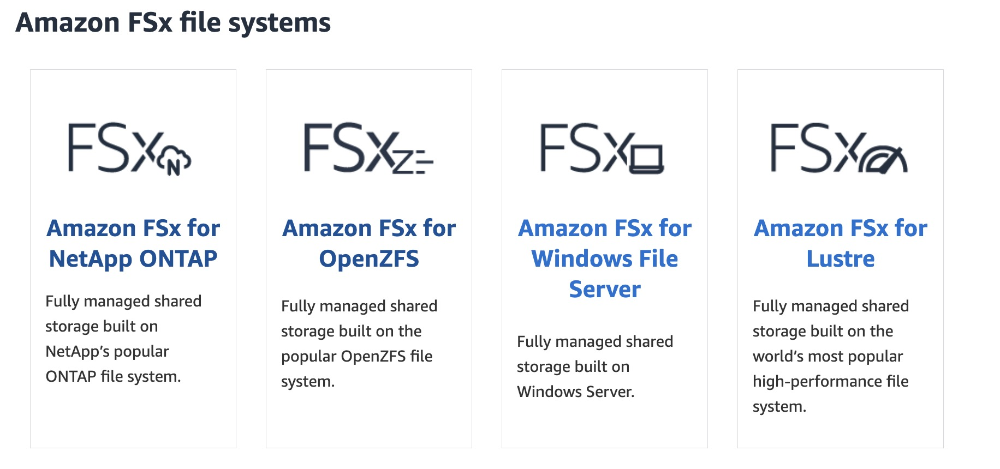

# Amazon Elastic File System（EFS）、FSx 和 Storage Gateway

## Amazon Elastic File System (EFS)

EFS 是 AWS 提供的雲端檔案系統，依照儲存檔案的大小和存取計價。

## AWS FSx

FSx 和 EFS 一樣是雲端檔案系統服務，但它提供四種不同的檔案系統。

## AWS Storage Gateway

AWS Storage Gateway 提供一個讓你存取雲端儲存空間的介面，舉例來說，你可以設定 Amazon S3 File Gateway，讓本地檔案系統可以透過這個介面存取 S3 的資料。計費項目包括檔案大小、存取請求數量和從 AWS 傳送出去的數據量。
