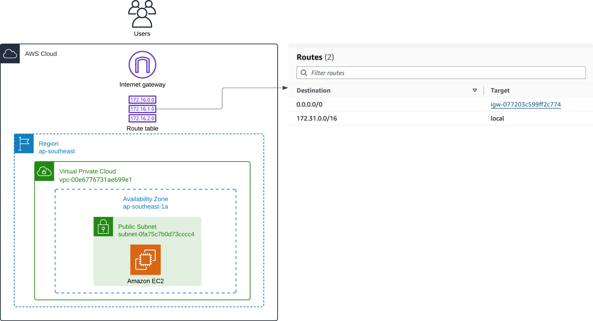
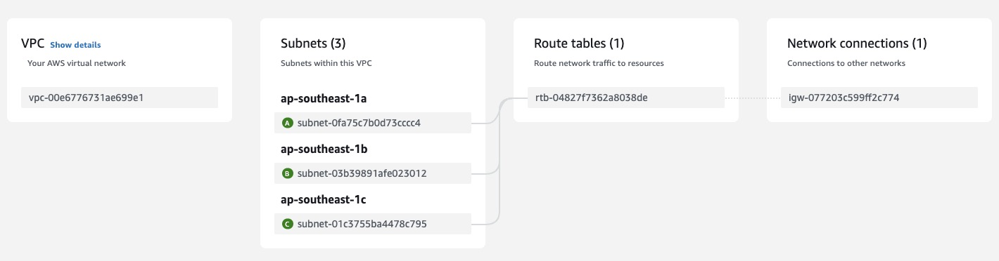

# VPC, Subnet, Route Table 與 Gateway

## VPC 與 Subnet

只有 Region 與 AZ 還不足以讓我們可以部署服務，我們還需要 Virtual Private Cloud (VPC) 和 Subnet。VPC 是一個虛擬私人網路，每個 VPC 擁有一個 IPv4 CIDR block，這代表一個區間的 IPv4 位址，我們可以在 VPC 內創建 Subnet，Subnet 也會從所屬 VPC 內的 IPv4 CIDR block 分配到一個 IPv4 CIDR block。

舉例來說，如果我們在一個 IPv4 CIDR block 為 172.31.0.0/16 內創建一個 Subnet，這個 IP 區間範圍從 172.31.0.0 到 172.31.255.255 結束（可以使用 [Subnet Calculator](https://mxtoolbox.com/subnetcalculator.aspx) 計算），因此這個 Subnet 被分配或指定的 IPv4 CIDR block 一定會在這個區間，例如 172.31.0.0/20（172.31.0.0 到 172.31.15.255）

## Internet Gateway 與 Route Table

既然 VPC 是虛擬私人網路，我們要如何讓部署在其中的服務能夠連接外部網路呢？

我們需要 Internet Gateway 與 Route Table 的幫助。

透過把 Internet Gateway 連接到 Public Subnet 上，並在 Route Table 設定 Routes，我們讓 Subnet 內擁有公開 IP 位址的服務能夠和外部網路互動。

我利用 AWS VPC Dashboard 中的 Resource map 畫成如下的架構圖，讓我們更好理解他們之間的關係。

可以看到右方的 Route Table 設定了 Destination 與 Target，這代表當一個請求的目標 IP 位址落在 Destination 的區間時，把這個請求導到 Target。

因此，這個 Route Table 會把 172.31.0.0/16 區間的請求導到 local，也就是 Route Table 所屬的 VPC 本身。這個區間外的請求會被導到 Internet Gateway，如此一來，Subnet 裡的服務就可以連接到外界網路了

上方的示意圖來源來自 AWS VPC Dashboard 中的 Resource Map

