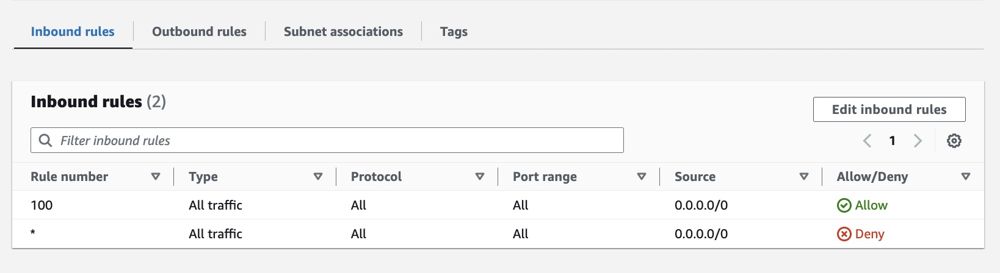

# VPC 的 Network Access Control List (NACL) 與 Security Groups

## NACL 是什麼？

NACL 讓你可以控制進出 Subnet 的請求。每一個 VPC 都預設一個容許來自所有地方請求的 NACL。每個 Subnet 一定會有一個 NACL，如果在創建 Subnet 時，你沒有選擇 NACL，它會是 VPC 的預設 NACL。每個 Subnet 只能有一個 NACL，設定新的 NACL 時，舊的會直接被替換掉。

接下來，我們看一下預設 NACL 的 Rule 設定，先看 VPC 預設的 NACL Inbound Rule。

Inbound Rule 的 Source 是向我們 Subnet 發送請求的 IP 位址，因此第一條規則允許來自任何地方的請求。

你會注意到，第一條與第二條規則是相悖的。但因爲第二條的 Rule Number 是預設星號，因此，Rule Number 100 的規則會優先於它。

而在 NACL 的 Outbound Rule 中，Destination 是指可以離開 Subnet 的請求位址。

綜合以上的解釋舉例來說，如果你的 Source 和 Destination 設定為 172.31.1.2/32，只有 IP 位址為 172.31.1.2 的電腦才能連接到你 Subnet 的服務。

## Security Groups 是什麼？

Security Groups 在目的上一樣是用來控制進出的請求，且在設定頁面也分為 Inbound Rules 與 Outbound Rules，但與 NACL 不一樣的是，他控制的是進出服務的請求，像是 EC2。還有一點與 NACL 不一樣，Security Group 是 stateful，舉例來說，如果你的服務向某個 Outbound Rules 禁止的位址發送請求，回傳的 response 就不會受 Outbound Rules 影響，反之亦然。
